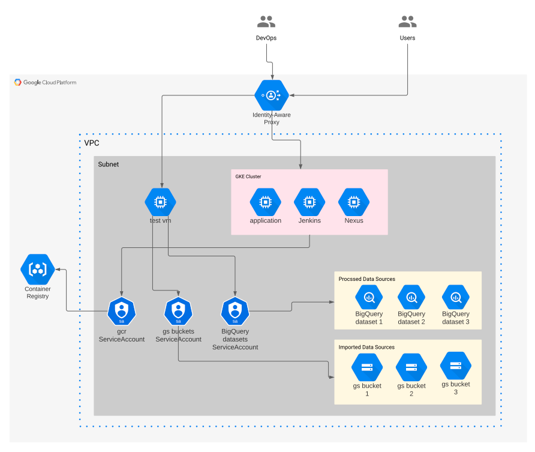
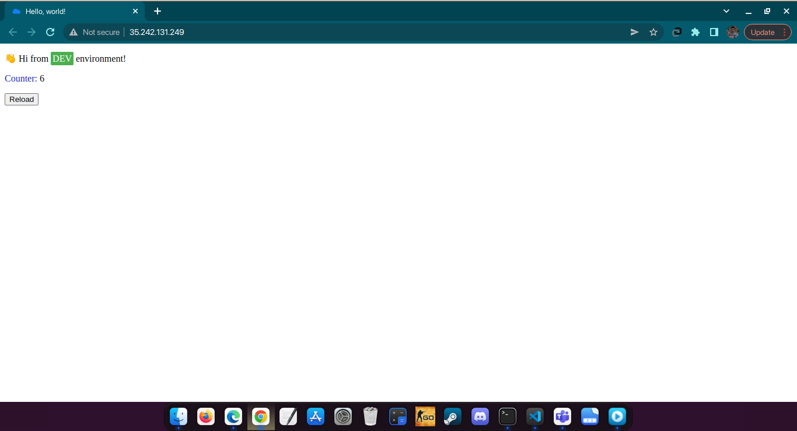
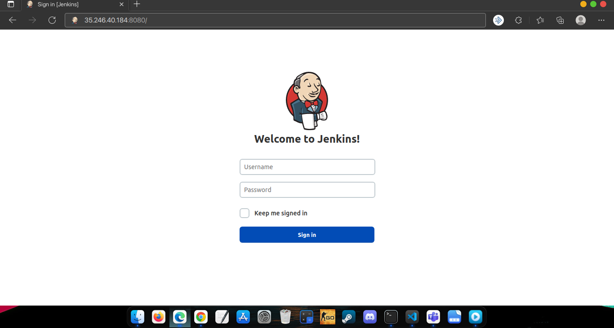

# Google Cloud platform On boarding task

## Description
This task is part of the On boarding process for a platform engineer using Terraform, Google cloud and GKE

## The Infrastructure

## Jenkins and the application

- Docker image repository [Docker hub](https://hub.docker.com/r/alaaamin/reload-count-tornado-py-app)
- Testing the application deployment

- Testing the Jenkins deployment

## Author

[Alaa A. Amin](https://www.linkedin.com/in/alaaamin-swe/)